# Deployment and Custom Domain Setup

> This is a sample for Deployment and Custom Domain Setup

## Links

**Netlify Subdomain** : https://nikenhpsr.netlify.app

**Custom Domain** : http://nikenhpsr.site/

**GitHub Repository** : https://github.com/revou-fsse-1/w1-my-personal-website-nikenhpsr

## Deployment Guide

**1. Sign Up to Deployment Platform**

First, You need to have an account in Website Deployment Services. There are many companies that provide these services including **GitHub Pages**, **Vercel**, **Netlify**, and **Heroku**. You can see comparisons between those four services [in here.](https://ritza.co/articles/heroku-vs-netfliy-vs-vercel-vs-github-pages-vs-firebase-vs-vercel/)

_For this time, I will show you how to deploy Github Repo on Netlify._

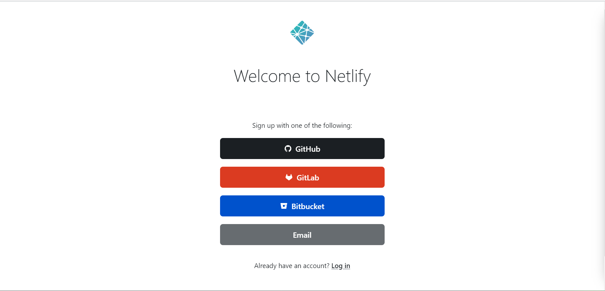

You can directly sign up to netlify using your GitHub account. Just click on the GitHub button above. Then give the permissions to access your GitHub Repository

**2. Import GitHub Repository**

- Add your site using GitHub Repository

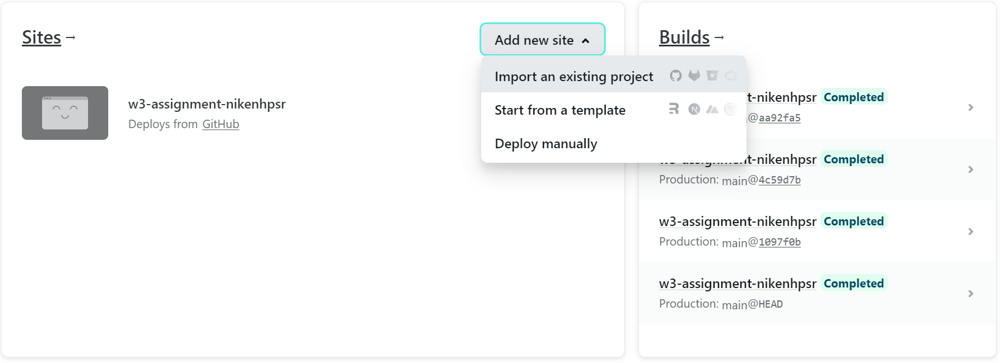

- Connect with your Git Provider

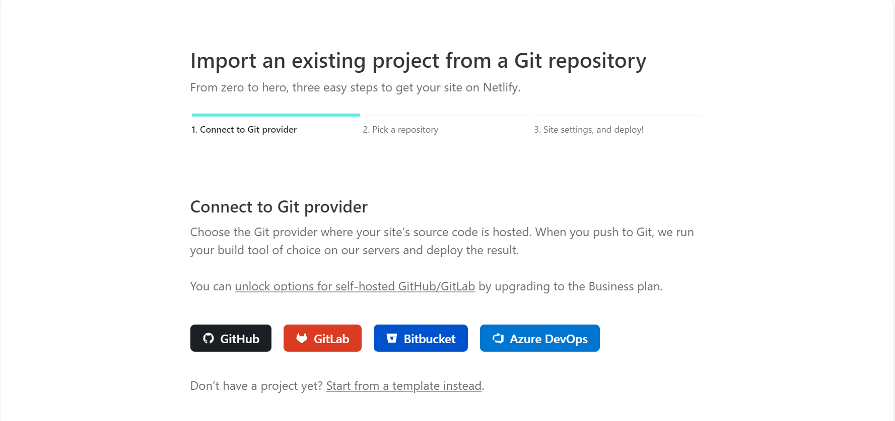

- Choose projects to be deployed

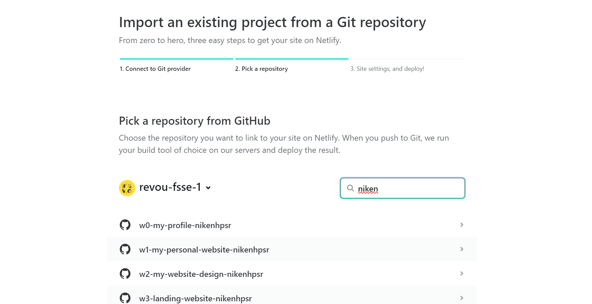

- Deploy your site

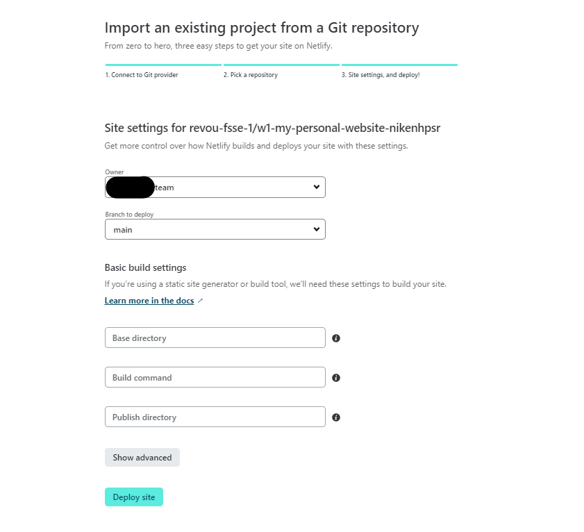

*Note: you can change your site name through site settings in Netlify*

## Custom Domain Setup

**1. Buy Custom Domain Name**

You need to buy costum domain through web hosting services. Choose the one that's most convenient for you.

**2. Setting Up Your Domain on Cloudfare**

- If you already has a domain, you can go to Cloudfare (Register if you don't have an account) then go to ***Website Tab*** and **Add Site**

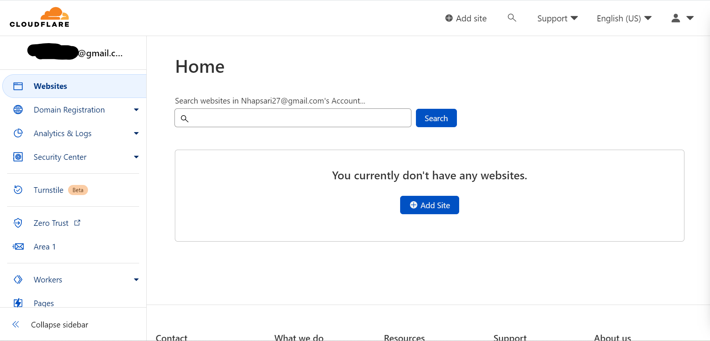

- Then enter your custom domain name

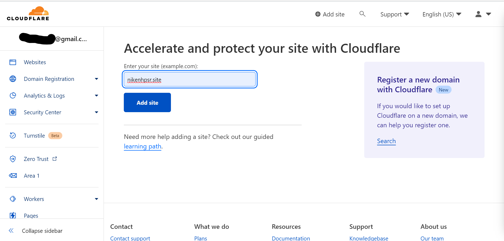

- Choose your desired plan

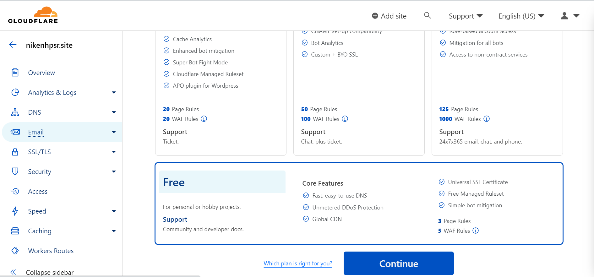

- If you've already choose a plan, you need to add two DNS records. See the examples below: 

> Type: CNAME
>
> Name: @
>
> Input: [*Enter your Netlify domain name*]

> Type: CNAME
>
> Name: www
>
> Input: [*Enter your Netlify domain name*]

Those two DNS records are essential, you musn't skip this step. If you're done, you may press the **Continue** button

- **Don't forget to change your nameserver to Cloudfare's nameserver!!**

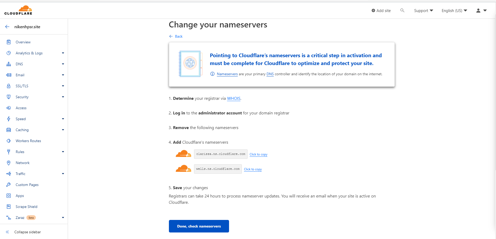

**3. Setting Up Custom Domain to Netlify**

- Go to your site then choose **Set up a Custom Domain**

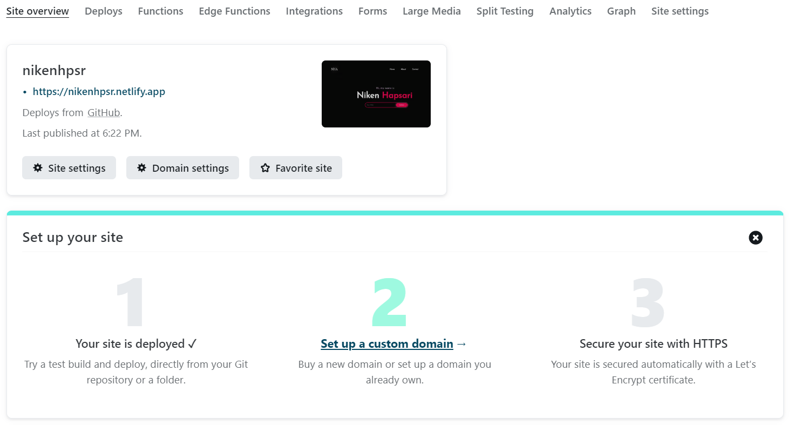

- Enter your custom domain name, then you need to **Verify** it

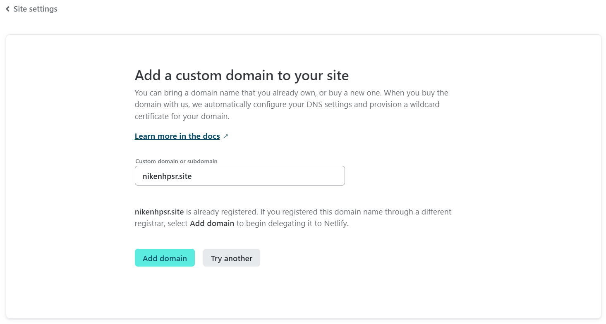

- All set! You may need to wait for a while before your site can be accessed

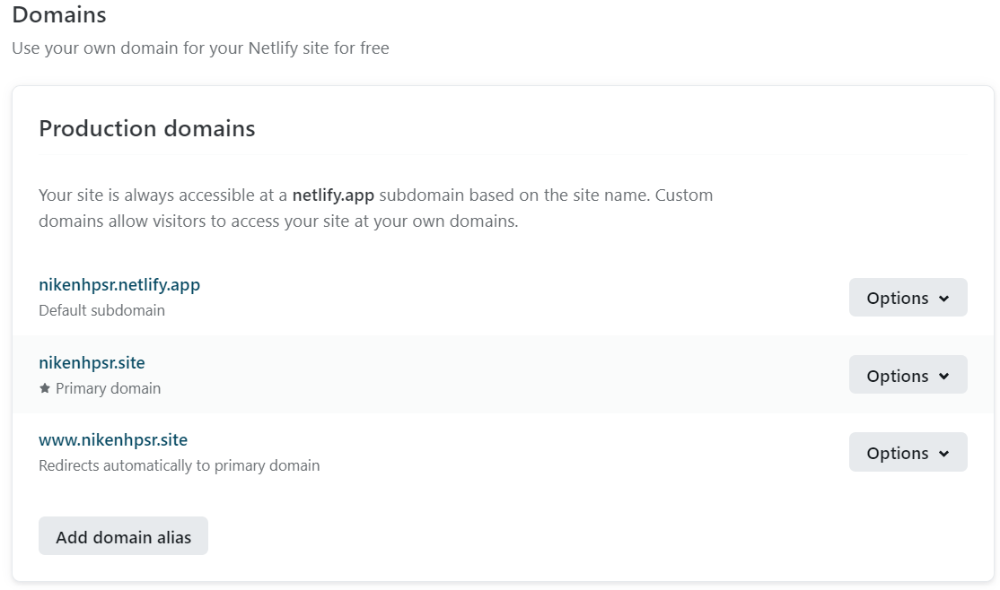

![preview](./assets